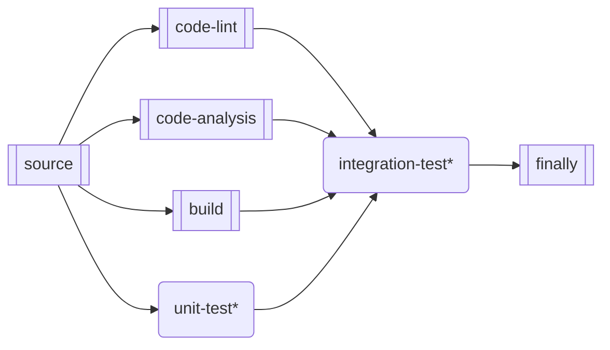

# (48270) Parallelize GitHub Actions workflow

TODO: Create probable diagrams of [org-level Workflows](https://docs.github.com/en/actions/learn-github-actions/sharing-workflows-with-your-organization) that should be available for any given GitHub repository.

A GitHub Actions Workflow represents a distinct and independent unit of work. A Workflow's execution can trigger another Workflow, but there is currently no native way to pass data ('state') between Workflows.

* Workflows are a good natural barrier for functionality and can be triggered by different events
* In any given Workflow, the target for improving the speed and efficacy of GitHub Actions is the Job entity.

## A sample CI Workflow

The graph below demonstrates a hypothetical CI Workflow, with each 'node' representing a Workflow Job and described here.

> NOTE: Job ordering is based on each Job's __needs__ attribute, which governs the overall flow of work.

`source`: id1
  - download the code
  - install dependencies
  - upload the working folder as an artifact (usable by all downstream Jobs)

`code-lint`: id2
  - download code artifact
  - perform code linting

`code-analysis`: id3
  - download code artifact
  - perform static code analysis

`build`: id4
  - download code artifact
  - compiles/transpiles the code
  - uploads build artifact (usable by all downstream Jobs)

`unit-test*`: id5
  - download code artifact
  - (conditionally) download build artifact
  - executes unit tests
    - can use matrix strategy to run N test groups in parallel

`integration-test`: id6
  - download code artifact
  - (conditionally) download build artifact
  - executes tests that have resource dependencies
    - example: db:seed using MongoDB memory-server instance
    - can use matrix strategy to run N test groups in parallel

`finally`: id7
  - a conceptual step (notify / publish / purge artifacts / etc.)

### case 1:

- 'unit-test' DOES NOT require 'build'
- 'integration-test` requires 'build'

## case 2
      <li>'unit-test' requires 'build'</li>
      <li>'integration-test` requires 'build'</li>
    </ul>
  </b>
  

  graph LR
    id1[[source]] --> id2[[code-lint]] --> id4[[build]]
    id1[[source]] --> id3[[code-analysis]] --> id4[[build]]
    id4[[build]] --> id5(unit-test*) --> id7[[finally]]
    id4[[build]] --> id6(integration-test*) --> id7[[finally]]
  

</body>

</html>
